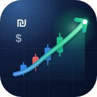

# MarketMaster — ניהול תיק השקעות · ת"א + ניו יורק · מנוע תובנות Claude

אפליקציית **קובץ HTML יחיד** (ללא שרת, ללא build) לניהול תיק מניות הנסחרות בבורסת תל אביב (TASE) ובבורסות ניו יורק (NYSE / NASDAQ), עם מנוע תובנות מובנה המבוסס על Claude API.

## הפעלה
**אונליין (GitHub Pages):** https://dudutal-dev.github.io/MarketMaster/ — נפרס אוטומטית מ-`main` (Workflow `pages.yml`).

**מקומי:**
1. פתחו את `index.html` בדפדפן (Chrome / Safari / Edge, מחשב או סלולר).
2. **הגדרות → מפתח API** — הדביקו מפתח Anthropic (`sk-ant-…`) ולחצו *בדוק חיבור*.
   המפתח נשמר ב-`localStorage` של הדפדפן בלבד ונשלח ישירות ל-`api.anthropic.com`.
3. הוסיפו אחזקות (או *טען תיק לדוגמה*) ולחצו **עדכן שערים**.

> **PWA:** "הוסף למסך הבית" מ-Safari/Chrome — האפליקציה נפתחת כאפליקציה עצמאית עם אייקון ייעודי (`manifest.webmanifest`, אייקונים ב-`assets/`), safe-area וניווט תחתון.

## מה יש בפנים
| מסך | יכולות |
|---|---|
| **דשבורד** | שווי תיק, שינוי יומי, רווח/הפסד, שער דולר; גרף שווי לאורך זמן (נבנה מכל עדכון שערים); חלוקה לפי סקטור / בורסה / מטבע; תנועות היום; תובנות מהירות (ריכוזיות, חשיפת מט"ח, פיזור, שערים לא עדכניים). |
| **התיק שלי** | טבלת אחזקות ממוינת וניתנת לחיפוש, הוספה/עריכה/מחיקה, השלמה אוטומטית ל-120+ ניירות (ת"א, ארה"ב, ADR ישראליים, ETF), ייבוא/ייצוא JSON ו-CSV, רווח/הפסד לפי אחזקה. |
| **סורק שוק** | בחירת תחומי פעילות ובורסות → Claude + Web Search מאתר מניות חמות, פריצות טכניות, מומנטום או ערך, עם אזור כניסה / סטופ / יעד / R:R / ביטחון / קטליזטור, דופק שוק ותמונת סקטורים. הוספה לתיק בלחיצה. |
| **מנוע תובנות** | ניתוח עומק של התיק לפי פרופיל סיכון: ציון תיק, פיזור/איכות/מומנטום/בקרת סיכון, חוזקות, סיכונים, **אותות פריצה באחזקות**, המלצות פעולה (BUY/ADD/HOLD/TRIM/SELL), תוכנית איזון סקטוריאלית, גידור מט"ח, הקשר מאקרו. בנוסף מדדים מקומיים (HHI, Top-3, חשיפה לדולר). |
| **ניתוח מניה** (לחיצה על שורה) | תמונת מצב, **תוצאות כספיות אחרונות** מול קונצנזוס, **חדשות** 30 יום עם קישורים וסנטימנט, ניתוח טכני (תמיכה/התנגדות, MA50/200, סטטוס פריצה), הערכת שווי, **תחזית** Bull/Base/Bear עם הסתברויות ויעדים, קטליזטורים, סיכונים והמלצה לפוזיציה. |

- **מטבעות:** מעבר מיידי ₪ / $ בכל המסכים; שער USD/ILS מתעדכן אוטומטית עם השערים או ידנית.
- **שפות:** עברית (RTL) / English — החלפה בלחיצה.
- **ערכות עיצוב:** בהיר / כהה / אוטומטי לפי מערכת.
- **שערי ת"א** מוצגים בש"ח (המערכת מזהה ומתקנת אגורות אוטומטית).

## ה-API
- קריאות ישירות מהדפדפן ל-`POST /v1/messages` (streaming SSE) עם `anthropic-dangerous-direct-browser-access`.
- מודל ברירת מחדל: `claude-opus-5` (ניתן לבחור Sonnet 5 / Haiku 4.5). עומק חשיבה דרך `output_config.effort`.
- כלי `web_search_20260209` לשערים, חדשות וסריקות. תגובות JSON מובנות; במקרה של כשל פענוח מוצג הטקסט הגולמי.
- ב-Opus 5 מופעל `fallbacks: "default"` (beta) עם נסיגה אוטומטית אם ה-beta אינה זמינה בחשבון.

## נתונים ופרטיות
כל הנתונים (אחזקות, היסטוריה, ניתוחים, הגדרות, מפתח) נשמרים ב-`localStorage` של הדפדפן בלבד. השתמשו ב-*גיבוי מלא (JSON)* לשמירה חיצונית.

## גילוי נאות
המידע מופק על ידי מערכת תומכת החלטה ואינו מהווה ייעוץ השקעות, שיווק השקעות או הצעה לרכישת ניירות ערך. השקעה בניירות ערך כרוכה בסיכון, לרבות אובדן מלא של ההשקעה. ביצועי עבר אינם ערובה לתשואות עתידיות.
